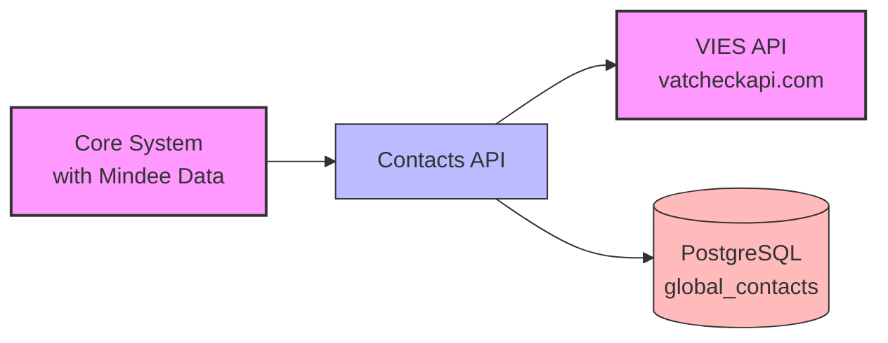
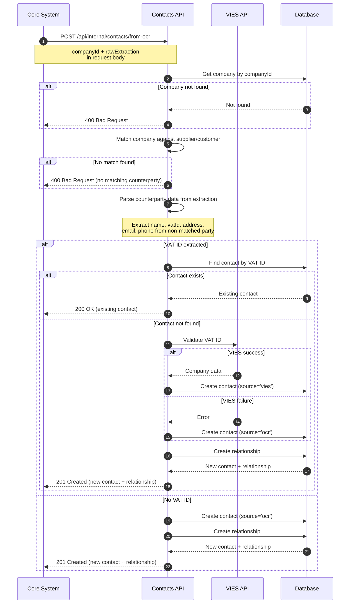
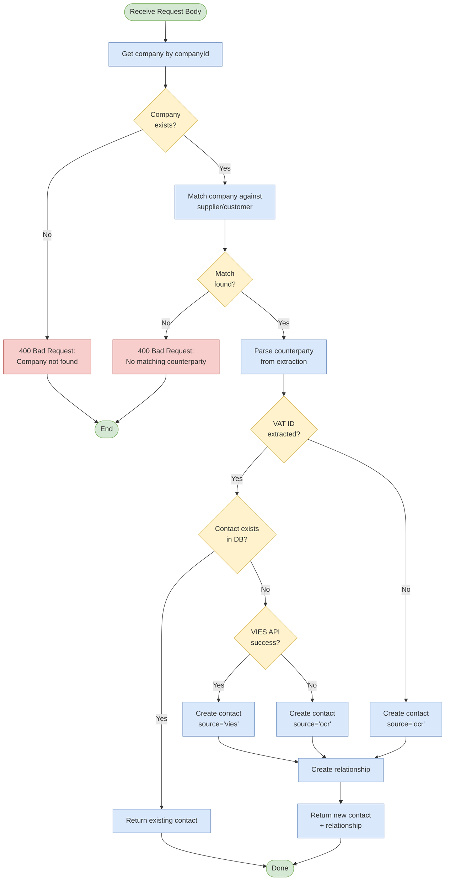
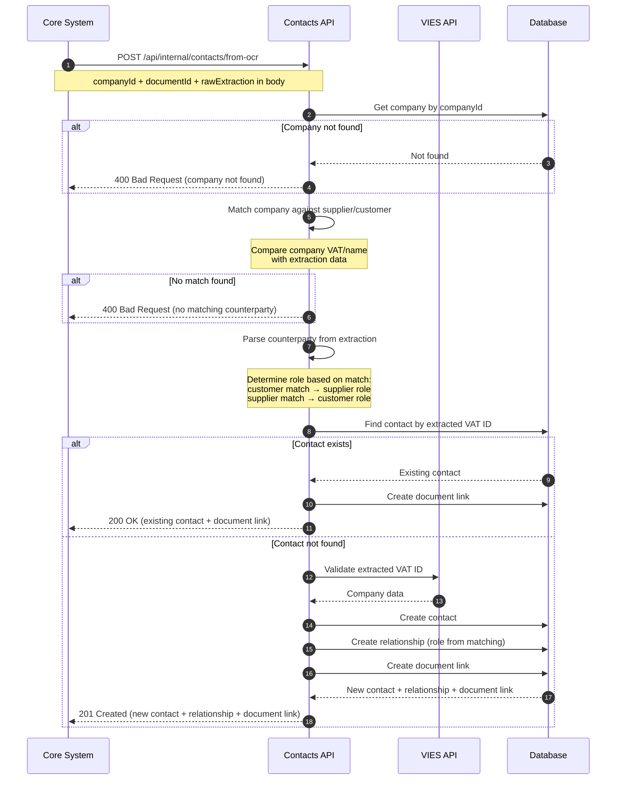
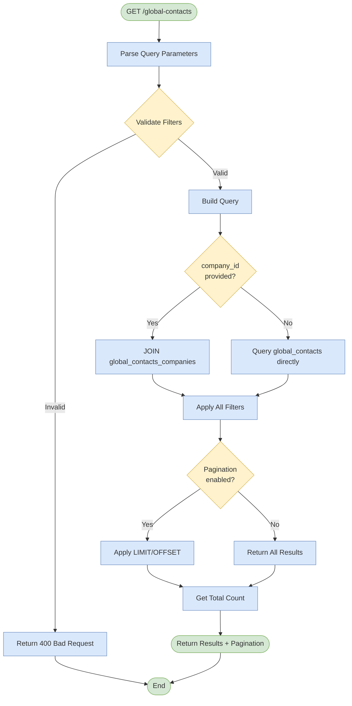

# VAT ID MVP - Global Contacts DB and Contact Data Extraction

## Overview

This feature automates the normalization and VAT ID validation of counterparties on incoming supplier invoices. When contact data is submitted (pre-extracted via Mindee OCR externally), the system validates VAT IDs through the VIES API (via vatcheckapi.com), and stores contact data in a global contacts database for consistent, audit-proof accounting operations.

The feature reduces manual verification work by automatically identifying invoice counterparties, creating a single source of truth for contact data across the system. Contacts can originate from external OCR extraction or VIES validation, with full traceability of data source.

## Goals and Non-Goals

### Goals

- Accept pre-extracted VAT ID and contact data from external invoice processing (Mindee OCR)
- Validate VAT IDs and retrieve legal entity information via VIES API
- Store VIES API Response for audit purposes
- Create and maintain a global contacts database with source tracking
- Return existing or newly created contact records
- Provide fallback behavior when VAT validation fails

### Non-Goals

- User interface for contact management (MVP scope)
- Contact data normalization or deduplication algorithms
- Manual VAT ID validation beyond VIES API check
- Address standardization or geocoding
- Contact merge/split functionality
- Batch processing of historical documents
- Direct Mindee OCR integration (extraction happens externally in MVP)
- Invoice data storage (only contact data is stored in MVP)

## Functional Requirements

### FR-1: Extracted Contact Context API

- The system SHALL expose an internal API endpoint to create or retrieve contacts from pre-extracted OCR data
- The system SHALL accept raw OCR extraction data (Mindee format) in the request body
- The system SHALL require a `companyId` field in the request body to identify the requesting company
- The system SHALL require service-to-service authentication (API key or bearer token)
- The system SHALL process the data synchronously and return results
- The system SHALL store the complete document extraction data from the OCR provider for audit purposes (includes all extracted fields, not just contact data)

### FR-2: Contacts Database Management

- The system SHALL maintain a global_contacts table for counterparty data
- The system SHALL support two contact types: 'legal_entity' and 'individual'
- The system SHALL default `entity_type` to 'legal_entity' for all contacts
- The system SHALL allow explicit override of `entity_type` to 'individual' when provided in the request
- The system SHALL track data source for each contact: 'ocr' or 'vies'
- The system SHALL enforce unique constraint on VAT ID where not null
- The system SHALL store both billing and postal addresses as structured JSON
- The system SHALL support the following contact fields:
  - Name (required)
  - Email
  - Phone
  - VAT ID
  - VAT type (eligible/exempt)
  - Tax number
  - Contact person
  - Contact type (legal_entity/individual, defaults to legal_entity)
  - Source (ocr/vies)
  - Billing address
  - Postal address
  - Raw extraction data (complete OCR document extraction for audit, includes all extracted fields like invoice data, line items, totals, etc.)
  - Raw VIES response (VIES API response for audit)
  - Country code
  - Is Valid VAT ID (boolean, default false) - indicates whether VAT ID was validated successfully via VIES
  - VAT ID Validated At (timestamp, default null) - timestamp when VAT ID was validated via VIES

### FR-3: VIES API Integration

- The system SHALL integrate with vatcheckapi.com for VAT ID validation
- The system SHALL call VIES API when a VAT ID is provided and no existing contact is found
- The system SHALL extract the following from VIES response:
  - Company name
  - Registered address
  - VAT registration status
  - Country code
- The system SHALL store a comprehensive raw response for audit purposes, including:
  - The normalized VAT ID that was validated
  - The API URL that was called
  - HTTP status code (undefined on network errors)
  - The response body (raw API response)
  - Request timing information (start timestamp, end timestamp, duration in milliseconds)
- The system SHALL capture raw response data for both successful and failed VIES requests
- The system SHALL handle VIES API rate limits and quotas
- The system SHALL fall back to submitted OCR data if VIES lookup fails

### FR-4: Contact Resolution

- The system SHALL follow this contact resolution flow:
  1. Receive pre-extracted contact data with VAT ID (if present)
  2. If VAT ID provided, search global_contacts table by VAT ID
  3. If contact exists, return existing contact
  4. If contact not found, call VIES API for validation
  5. If VIES returns valid data, create contact with source='vies', is_valid_vat_id=true, vat_id_validated_at=now()
  6. If VIES fails or no VAT ID, create contact from submitted OCR data with source='ocr', is_valid_vat_id=false, vat_id_validated_at=null (VAT ID from OCR is still stored for audit purposes)
  7. Return created contact
- The system SHALL be idempotent (same VAT ID returns same contact)
- The system SHALL always store the VAT ID from OCR extraction, even when VIES validation fails

### FR-5: Error Handling

- The system SHALL handle VIES API failures gracefully and proceed with submitted OCR data
- The system SHALL log all errors with sufficient detail for debugging
- The system SHALL return meaningful error messages to API callers
- The system SHALL validate submitted data and return appropriate validation errors

### FR-5.1: Counterparty Matching and Contact Extraction

- The system SHALL match the supplier and customer from the raw extraction against the company identified by `companyId`
- The system SHALL query the company data (name and VAT ID) from the database for the given `companyId`
- The system SHALL compare the company data against both the supplier and customer in the raw extraction:
  - Match by VAT ID (primary matching criteria, case-insensitive, ignoring spaces)
  - If VAT ID is not available, match by name (normalized comparison)
- The system SHALL determine the counterparty to create based on matching results:
  - If the company matches the **customer** in the extraction → create a **supplier** contact (expense document)
  - If the company matches the **supplier** in the extraction → create a **customer** contact (income document)
- The system SHALL return a 400 Bad Request error if neither the supplier nor customer matches the company
- The system SHALL extract contact data from the non-matched party using the raw extraction parsing rules (see TR-5.1)
- After extracting the contact data, the system SHALL continue with the standard contact resolution flow (VIES validation, etc.)

## Technical Requirements

### TR-1: Database Schema - Global Contacts Table

The system SHALL create a `global_contacts` table using Drizzle ORM.

**Implementation:**
- Define the schema in `src/db/schema-local.ts` using Drizzle's schema definition API
- Generate migration using `pnpm db:generate`
- The generated migration will be placed in `src/db/migrations/`

**Expected SQL output** (generated by Drizzle):

```sql
CREATE TABLE "global_contacts" (
  "id" uuid PRIMARY KEY DEFAULT gen_random_uuid() NOT NULL,
  "created_at" timestamp with time zone DEFAULT now() NOT NULL,
  "updated_at" timestamp with time zone DEFAULT now() NOT NULL,
  "name" text NOT NULL,
  "email" text,
  "entity_type" varchar(32) DEFAULT 'legal_entity' NOT NULL,
  "source" varchar(32) NOT NULL,
  "phone" varchar(50),
  "vat_id" varchar(20),
  "vat_type" varchar(32),
  "tax_number" varchar(30),
  "contact_person" text,
  "country_code" varchar(2),
  "billing_address" jsonb,
  "postal_address" jsonb,
  "raw_extraction" jsonb,
  "raw_vies_response" jsonb,
  "is_valid_vat_id" boolean DEFAULT false NOT NULL,
  "vat_id_validated_at" timestamp with time zone,
  CONSTRAINT "global_contacts_entity_type_check" CHECK ("global_contacts"."entity_type" IN ('legal_entity', 'individual')),
  CONSTRAINT "global_contacts_source_check" CHECK ("global_contacts"."source" IN ('ocr', 'vies')),
  CONSTRAINT "global_contacts_vat_type_check" CHECK ("global_contacts"."vat_type" IS NULL OR "global_contacts"."vat_type" IN ('eligible', 'exempt'))
);

-- Unique index on VAT ID where not null
CREATE UNIQUE INDEX "idx_global_contacts_vat_id" ON "global_contacts" USING btree ("vat_id") WHERE "global_contacts"."vat_id" IS NOT NULL;

-- Additional indexes for common queries
CREATE INDEX "idx_global_contacts_country_code" ON "global_contacts" USING btree ("country_code");
CREATE INDEX "idx_global_contacts_source" ON "global_contacts" USING btree ("source");
CREATE INDEX "idx_global_contacts_name" ON "global_contacts" USING btree ("name");
```

### TR-2: Address Schema

The billing_address and postal_address JSONB fields SHALL use this structure:

```typescript
interface Address {
  countryCode: string;      // ISO 3166-1 alpha-2 (e.g., 'DE') - always required
  city?: string;            // Optional - provided by OCR extraction
  postalCode?: string;      // Optional - provided by OCR extraction
  addressLine: string;      // Required - Full address line
}
```

**Note:** All addresses use `addressLine` for the full address string. Both VIES and OCR sources provide the address as a single line.

### TR-3: VIES API Integration (vatcheckapi.com)

- The system SHALL use vatcheckapi.com v2 API for this MVP
- The system SHALL use the existing HTTP client from `src/lib/http.ts` for API calls
  - Leverage built-in timeout handling (default 30s)
  - Leverage built-in retry logic with exponential backoff
  - Leverage built-in request/response logging
- The system SHALL configure API key via environment variable `VIES_API_KEY`
- Base URL: `https://api.vatcheckapi.com/v2`
- The system SHALL call `GET /check?vat_number={vatNumber}` endpoint
- The system SHALL pass API key via `apikey` header
- The system SHALL handle rate limiting (429 responses) with exponential backoff
- The system SHALL parse response to extract:
  - `country_code`: Country of registration
  - `registration_info.name`: Company name
  - `registration_info.address`: Registered address (stored as `addressLine` in billing_address, not parsed into structured fields)
  - `registration_info.is_registered`: Validity status

**Raw Response Structure:**

The system SHALL capture a comprehensive raw response for all VIES API calls (successful and failed) using this structure:

```typescript
interface ViesRawResponse {
  /** The normalized VAT ID that was validated */
  vatId: string;
  /** The API URL that was called */
  url: string;
  /** HTTP status code (undefined on network errors) */
  status: number | undefined;
  /** The response body (raw, could be ViesApiResponse or error object) */
  body: unknown;
  /** Timestamp when request started (ms since epoch) */
  startMs: number;
  /** Timestamp when request ended (ms since epoch) */
  endMs: number;
  /** Duration in milliseconds */
  durationMs: number;
  /** Human-readable start timestamp (ISO 8601 format) */
  start: string;
  /** Human-readable end timestamp (ISO 8601 format) */
  end: string;
  /** Human-readable duration (e.g., "123ms", "1.5s") */
  duration: string;
}
```

**Duration Format:**
- Durations under 1 second: `"123ms"`
- Durations 1 second or more: `"1.5s"` or `"2s"`

This structure enables:
- Full audit trail of VIES API interactions
- Performance monitoring and debugging with human-readable timestamps
- Traceability for both successful validations and failures
- Easy log analysis with ISO 8601 formatted timestamps

### TR-4: Module Organization

The system SHALL create a new module at `src/modules/contacts/` with:

```
src/modules/contacts/
  api/
    contacts.contracts.ts              # ts-rest contracts
    contacts.routes.ts                 # Fastify routes
    contacts.routes.test.ts            # Route tests
  services/
    vies.service.ts                    # VIES API client
    vies.service.test.ts
    contact-resolver.service.ts        # Main orchestration service
    contact-resolver.service.test.ts
  repositories/
    contacts.repository.ts             # Contacts data access
    contacts.repository.test.ts
  domain/
    contact.entity.ts                  # Contact types and entities
    contact.types.ts
    address.types.ts
  index.ts                             # Module exports
```

**Database Schema:**
- The `global_contacts` table schema SHALL be defined in `src/db/schema-local.ts`
- The repository layer will import the schema from this location

### TR-5: API Endpoint

The system SHALL expose the following internal API endpoint:

```
POST /api/internal/contacts/from-ocr
```

**Request:**
- Authentication: Service-to-service authentication (API key or bearer token from core system)
- Content-Type: application/json

**Request Body:**
```json
{
  "companyId": "uuid-of-company",
  "documentId": "uuid-of-document",
  "rawExtraction": {
    "supplierName": { "value": "ACME Corp" },
    "customerName": { "value": "Client Inc" },
    "supplierAddress": { "value": "123 Main St, Berlin, Germany" },
    "customerAddress": { "value": "456 Oak Ave, Munich, Germany" },
    "supplierEmail": { "value": "billing@acme.de" },
    "supplierPhoneNumber": { "value": "+49 30 12345678" },
    "supplierCompanyRegistrations": [
      { "type": "VAT NUMBER", "value": "DE123456789" }
    ],
    "customerCompanyRegistrations": [
      { "type": "VAT NUMBER", "value": "DE987654321" }
    ]
  }
}
```

**Request Field Details:**
- `companyId` (UUID, required): The ID of the company making the request. Used to identify which party (supplier or customer) in the extraction matches the requesting company.
- `documentId` (UUID, required): The ID of the source document from which the contact data was extracted. This links the created contact to its originating document for traceability.
- `rawExtraction` (object, required): Complete document extraction from OCR provider (e.g., Mindee API). This object contains all extracted fields including invoice data, line items, totals, dates, and contact information. The relevant contact fields are:
  - `supplierName.value` (string): Supplier/vendor name
  - `customerName.value` (string): Customer/client name
  - `supplierAddress.value` (string): Supplier address as a single line
  - `customerAddress.value` (string): Customer address as a single line
  - `supplierEmail.value` (string): Supplier email address
  - `supplierPhoneNumber.value` (string): Supplier phone number
  - `supplierCompanyRegistrations` (array): Array of registration objects, each with `type` and `value`
  - `customerCompanyRegistrations` (array): Array of registration objects, each with `type` and `value`

**Processing Flow:**
1. Validate `companyId` and `documentId` are present in request body
2. Query company data for `companyId` (name and VAT ID)
3. Match company against supplier and customer in the extraction (see FR-5.1)
4. If company matches customer → extract supplier as the new contact (expense document)
5. If company matches supplier → extract customer as the new contact (income document)
6. If no match found → return 400 Bad Request
7. Parse the counterparty data using TR-5.1 rules
8. Continue with standard contact resolution (VIES validation, etc.)

**Response (200 OK) - Existing contact found:**
```json
{
  "contact": {
    "id": "uuid",
    "name": "ACME Corp",
    "vatId": "DE123456789",
    "source": "vies",
    "entityType": "legal_entity",
    "email": "billing@acme.de",
    "phone": "+49 30 12345678",
    "countryCode": "DE",
    "billingAddress": { ... }
  }
}
```

**Response (201 Created) - New contact created:**
```json
{
  "contact": {
    "id": "uuid",
    "name": "ACME Corp",
    "vatId": "DE123456789",
    "source": "vies",
    "entityType": "legal_entity",
    "email": "billing@acme.de",
    "phone": "+49 30 12345678",
    "countryCode": "DE",
    "billingAddress": { ... }
  },
  "relationship": {
    "id": "uuid",
    "companyId": "uuid-of-company",
    "role": "supplier"
  },
  "documentLink": {
    "id": "uuid",
    "documentId": "uuid-of-document"
  }
}
```

**Response Field Details:**
- `id` (UUID): Contact ID
- `name` (string): Contact/company name (from VIES if validated, otherwise from OCR)
- `vatId` (string, nullable): Stored VAT ID (from OCR extraction or VIES validation). This field is returned even when VIES validation fails. Use `is_valid_vat_id` and `vat_id_validated_at` to determine validation status
- `source` (string): Source of contact data ('vies' or 'ocr')
- `entityType` (string): Entity type ('legal_entity' or 'individual')
- `email` (string, nullable): Contact email
- `phone` (string, nullable): Contact phone
- `countryCode` (string, nullable): ISO country code
- `billingAddress` (object, nullable): Structured address
- `relationship` (object, nullable): Company-contact relationship. Only present when a new contact is created
  - `id` (UUID): Relationship ID
  - `companyId` (UUID): The company ID from the request
  - `role` (string): Either 'supplier' or 'customer' based on document type
- `documentLink` (object): Document-contact link. Always present when a contact is created or found
  - `id` (UUID): Link ID
  - `documentId` (UUID): The document ID from the request

**Note:** The API response returns a subset of stored fields. Additional fields (e.g., `vatType`, `taxNumber`, `contactPerson`, `postalAddress`, `rawExtraction`, `rawViesResponse`) are stored in the database but not included in the response for this MVP endpoint.

**Error Responses:**
- 400 Bad Request: Invalid request body, validation errors, or no matching counterparty found
- 401 Unauthorized: Missing or invalid service authentication
- 500 Internal Server Error: Database or infrastructure temporarily unavailable

### TR-5.1: Raw Extraction Parsing Rules

The system SHALL parse the raw extraction data to extract contact fields using the following rules:

**Field Extraction:**

| Contact Field         | Supplier Extraction                                                                     | Customer Extraction                                                                     |
| --------------------- | --------------------------------------------------------------------------------------- | --------------------------------------------------------------------------------------- |
| `role`                | `'supplier'` (literal)                                                                  | `'customer'` (literal)                                                                  |
| `name`                | `supplierName.value`                                                                    | `customerName.value`                                                                    |
| `vatId`               | Find entry in `supplierCompanyRegistrations` where `type === 'VAT NUMBER'`, use `value` | Find entry in `customerCompanyRegistrations` where `type === 'VAT NUMBER'`, use `value` |
| `entityType`          | `'legal_entity'` if VAT ID is present, else `'individual'`                              | `'legal_entity'` if VAT ID is present, else `'individual'`                              |
| `address.addressLine` | `supplierAddress.value`                                                                 | `customerAddress.value`                                                                 |
| `address.countryCode` | Extract first 2 characters from VAT ID if it starts with `[A-Z]{2}`                     | Extract first 2 characters from VAT ID if it starts with `[A-Z]{2}`                     |
| `email`               | `supplierEmail.value`                                                                   | `null` (not available in customer extraction)                                           |
| `phone`               | `supplierPhoneNumber.value`                                                             | `null` (not available in customer extraction)                                           |

**Parsing Implementation:**

```typescript
// Determine which party to extract (the non-matched party)
const isExpense = companyMatchesCustomer; // expense = company is customer, create supplier
const role: 'supplier' | 'customer' = isExpense ? 'supplier' : 'customer';

// Extract contact name
const name = isExpense 
  ? rawExtraction.supplierName?.value 
  : rawExtraction.customerName?.value;

// Extract VAT ID from company registrations
const registrations = isExpense 
  ? rawExtraction.supplierCompanyRegistrations 
  : rawExtraction.customerCompanyRegistrations;
const vatIdEntry = registrations?.find((r) => r.type === 'VAT NUMBER');
const vatId = vatIdEntry?.value ?? null;

// Determine entity type based on VAT ID presence
const entityType = vatId ? 'legal_entity' : 'individual';

// Extract address
const addressValue = isExpense 
  ? rawExtraction.supplierAddress?.value 
  : rawExtraction.customerAddress?.value;

// Extract country code from VAT ID prefix (e.g., 'LU35500410' -> 'LU')
const countryCode = vatId && /^[A-Z]{2}/.test(vatId) ? vatId.slice(0, 2) : null;

// Build structured address
const address = addressValue ? {
  countryCode: countryCode ?? undefined,
  addressLine: addressValue,
} : null;

// Extract email and phone (only available for supplier in Mindee)
const email = isExpense ? rawExtraction.supplierEmail?.value ?? null : null;
const phone = isExpense ? rawExtraction.supplierPhoneNumber?.value ?? null : null;
```

**Notes:**
- If `name` is not present in the extraction, the endpoint should skip contact creation and return an appropriate response
- The `countryCode` in the address is derived from the VAT ID prefix when available
- Email and phone are only extracted when creating a supplier contact (expense documents)
- All extracted values should be trimmed and validated before use

### TR-6: Configuration

The system SHALL require these environment variables:

```bash
# VIES API
VIES_API_KEY=             # Required: vatcheckapi.com API key
VIES_API_BASE_URL=        # Optional: Override base URL (default: https://api.vatcheckapi.com/v2)
```

### TR-7: Error Handling Strategy

- **Request Validation Errors:**
  - Missing required fields: Return 400 with field-level error details
  - Invalid data formats: Return 400 with validation message

- **VIES API Errors:**
  - Network errors: Log and fall back to submitted OCR data
  - Rate limiting (429): Retry after delay from headers
  - Invalid VAT: Log and fall back to OCR data (contact created without validated VAT)
  - Any other error: Log and fall back to OCR data

- **Database Errors:**
  - Unique constraint violation on VAT ID: Return existing contact (200 OK)
  - Use transactions for contact creation

### TR-8: Database Migration Implementation

The system SHALL use Drizzle ORM for database schema management and migrations.

**Implementation Steps:**

1. **Define Schema in Drizzle:**
   - Add the `globalContacts` table definition to `src/db/schema-local.ts`
   - Use Drizzle's schema API: `pgTable`, `uuid`, `text`, `varchar`, `jsonb`, `timestamp`, etc.
   - Define constraints using Drizzle's constraint helpers

2. **Generate Migration:**
   ```bash
   pnpm db:generate
   ```
   - This will create a new migration file in `src/db/migrations/`
   - Expected filename format: `0010_create_global_contacts.sql` (number may vary)

3. **Apply Migration:**
   ```bash
   pnpm db:migrate
   ```
   - This applies the migration to the local database
   - For production, migrations are applied via CI/CD pipeline

4. **Verify Migration:**
   - The migration file should match the SQL structure defined in TR-1
   - Ensure all indexes and constraints are properly created
   - Test that the migration can be rolled back if needed

**Note:** Follow existing migration patterns in `src/db/migrations/` for consistency.

## System Architecture

### System Context Diagram



## Data Flow

### Contact Resolution Flow



### Contact Resolution Decision Flow



## API Integration Details

### VIES API (vatcheckapi.com)

**Endpoint:** `GET https://api.vatcheckapi.com/v2/check`

**Request:**
```bash
curl -H "apikey: YOUR_API_KEY" \
  "https://api.vatcheckapi.com/v2/check?vat_number=LU26375245"
```

**Response:**
```json
{
  "country_code": "LU",
  "vat_number": "26375245",
  "format_valid": true,
  "checksum_valid": true,
  "registration_info": {
    "is_registered": true,
    "name": "AMAZON EUROPE CORE S.A R.L.",
    "address": "38, AVENUE JOHN F. KENNEDY\nL-1855  LUXEMBOURG",
    "checked_at": "2023-01-11T12:30:28.000000Z"
  }
}
```

## Security Considerations

- API keys for external services SHALL be stored securely and not logged
- The system SHALL validate and sanitize all extracted data before database storage
- The system SHALL use parameterized queries to prevent SQL injection
- The system SHALL require authentication for all API endpoints
- The system SHALL mask sensitive data (VAT IDs, addresses) in logs

## Monitoring and Observability

### Metrics

Setting up observability and monitoring is out of scope for the MVP. See future enhancements for planned metrics.

### Logging

- Log all API calls to VIES service with correlation IDs
- Log contact resolution decisions
- Log errors with full context for debugging
- Use structured logging (Pino) with appropriate log levels

### Alerts

- Alert on VIES API rate limit exhaustion
- 🚧 Alert on high error rates (>5% in 5 minutes)
- 🚧 Alert on database connection issues

## Error Scenarios

### Request Validation Errors

- **Missing `companyId` in body** → HTTP 400, message: "Missing required field: companyId"
- **Invalid `companyId` format** → HTTP 400, message: "Invalid format for companyId: must be a valid UUID"
- **Missing `rawExtraction` in body** → HTTP 400, message: "Missing required field: rawExtraction"
- **Invalid `rawExtraction` format** → HTTP 400, message: "Invalid format for rawExtraction: must be an object"

### Counterparty Matching Errors

- **Company not found** → HTTP 400, message: "Company not found for companyId: {companyId}"
- **No matching counterparty** → HTTP 400, message: "No matching supplier or customer found for company: {companyName}"
- **Missing contact name** → HTTP 400, message: "Contact name not found in extraction" (when the counterparty to create has no name)

### VAT Validation Errors

- **Invalid VAT format** → Log warning, create contact without validated VAT
- **VAT not registered** → Log info, create contact without VIES data
- **VIES API unavailable** → Log error, proceed with submitted OCR data

### Database Errors

- **Duplicate VAT ID** → Return existing contact (200 OK)
- **Connection error** → HTTP 500, message: "Database temporarily unavailable"

## Testing and Validation

All tests SHALL follow the **Arrange-Act-Assert (AAA)** pattern with clear comments (`// ARRANGE`, `// ACT`, `// ASSERT`).

### Unit Tests

- VIES service: Response parsing, error handling, rate limiting
- Contact resolver: Orchestration logic, contact resolution flow, counterparty matching
- Raw extraction parser: Field extraction, VAT ID parsing, address building
- Repositories: CRUD operations, query filtering

### Integration Tests

Integration tests verify the full API flow with external dependencies mocked:

- **VIES API**: Mocked using MSW (Mock Service Worker) to simulate various responses
- **Database**: Real PostgreSQL database (test instance)

#### Test Scenarios - Counterparty Matching

| Scenario                         | Input                                               | Expected Result                                    |
| -------------------------------- | --------------------------------------------------- | -------------------------------------------------- |
| Company matches customer         | Company VAT matches customerCompanyRegistrations    | 201, supplier contact created with role='supplier' |
| Company matches supplier         | Company VAT matches supplierCompanyRegistrations    | 201, customer contact created with role='customer' |
| Company matches by name (no VAT) | Company name matches customerName.value             | 201, supplier contact created                      |
| No match found                   | Company VAT/name doesn't match supplier or customer | 400, "No matching counterparty" error              |
| Company not found                | Invalid companyId                                   | 400, "Company not found" error                     |
| Missing companyId                | No companyId query param                            | 400, validation error                              |
| Missing rawExtraction            | Empty body or no rawExtraction                      | 400, validation error                              |

#### Test Scenarios - Contact Creation

| Scenario                   | Input                           | VIES Mock                      | Expected Result                              |
| -------------------------- | ------------------------------- | ------------------------------ | -------------------------------------------- |
| Happy path - VIES valid    | Extraction with VAT ID          | Returns valid company data     | 201, contact with source='vies'              |
| Existing contact           | Extracted VAT matches DB record | Not called                     | 200, existing contact returned               |
| VIES failure - network     | Extraction with VAT ID          | Network error                  | 201, contact with source='ocr'               |
| VIES failure - invalid VAT | Extraction with VAT ID          | Returns `is_registered: false` | 201, contact with source='ocr'               |
| VIES rate limited          | Extraction with VAT ID          | Returns 429                    | 201, contact with source='ocr' (after retry) |
| No VAT in extraction       | Extraction without VAT NUMBER   | Not called                     | 201, contact with source='ocr'               |
| No contact name            | Extraction with empty name      | Not called                     | 400, "Contact name not found" error          |
| Idempotency                | Same VAT ID twice               | Called once                    | First: 201, Second: 200 (same contact)       |

#### Test Scenarios - Raw Extraction Parsing

| Scenario                  | Input                                            | Expected Result                                    |
| ------------------------- | ------------------------------------------------ | -------------------------------------------------- |
| Full supplier extraction  | Complete supplier data in extraction             | Contact with name, vatId, email, phone, address    |
| Full customer extraction  | Complete customer data in extraction             | Contact with name, vatId, address (no email/phone) |
| VAT ID country extraction | VAT ID starting with 'LU'                        | countryCode='LU' in address                        |
| No VAT ID                 | Empty supplierCompanyRegistrations               | entityType='individual', no countryCode            |
| Multiple registrations    | Multiple entries in companyRegistrations         | Only VAT NUMBER type is extracted                  |
| Missing address           | No supplierAddress/customerAddress in extraction | address=null in contact                            |

#### Mocking Strategy

- **MSW handlers** for VIES API at `https://api.vatcheckapi.com/v2/check`
- **Test factories** for creating contact fixtures and raw extraction data
- **Company factory** for creating test companies with VAT IDs

## Risks and Mitigations

| Risk                      | Impact                    | Mitigation                                         |
| ------------------------- | ------------------------- | -------------------------------------------------- |
| VIES API downtime         | Missing legal entity data | Graceful fallback to extraction data, retry logic  |
| Incorrect extraction data | Wrong contact data        | Store raw extraction for audit, allow reprocessing |
| VAT ID format variations  | Lookup failures           | Normalize VAT IDs (remove spaces, uppercase)       |

## Local Testing

### Example Curl Request

```bash
curl "http://localhost:3000/api/internal/contacts/from-ocr" \
  -X POST \
  -H "Authorization: Bearer YOUR_TOKEN" \
  -H "Content-Type: application/json" \
  -d '{
    "companyId": "YOUR_COMPANY_UUID",
    "documentId": "YOUR_DOCUMENT_UUID",
    "rawExtraction": {
      "supplierName": { "value": "ACME Corp" },
      "customerName": { "value": "Your Company Name" },
      "supplierAddress": { "value": "123 Main St, Berlin, Germany" },
      "customerAddress": { "value": "456 Oak Ave, Munich, Germany" },
      "supplierEmail": { "value": "billing@acme.de" },
      "supplierPhoneNumber": { "value": "+49 30 12345678" },
      "supplierCompanyRegistrations": [
        { "type": "VAT NUMBER", "value": "DE123456789" }
      ],
      "customerCompanyRegistrations": [
        { "type": "VAT NUMBER", "value": "DE987654321" }
      ]
    }
  }'
```

**Note:** Replace `YOUR_COMPANY_UUID` with the actual company ID and `YOUR_DOCUMENT_UUID` with the source document ID. The company's VAT ID should match either the supplier or customer in the extraction. In this example, if the company has VAT ID `DE987654321`, it matches the customer, so a supplier contact will be created with role='supplier'.

### Environment Setup

```bash
# .env.local
VIES_API_KEY=your_vatcheckapi_key
```

## Contact-Document Linking

### FR-9: Contact-Document Linking

- The system SHALL support linking global contacts to documents via a many-to-many relationship
- The system SHALL store the document ID from the originating OCR extraction
- The system SHALL require a `documentId` field in the `/from-ocr` API request
- The system SHALL create a document link when a contact is created or found
- The system SHALL allow the same contact to be linked to multiple documents
- The system SHALL prevent duplicate links (same contact and document combination)
- The system SHALL cascade delete document links when a contact is deleted
- The system SHALL return the document link in the API response

## Company-Contact Relationships

### FR-6: Company-Contact Relationship Management

- The system SHALL support linking global contacts to companies via a many-to-many relationship
- The system SHALL store a `role` attribute for each relationship: 'customer' or 'supplier'
- The system SHALL allow the same contact to be linked to multiple companies with different roles
- The system SHALL prevent duplicate relationships (same contact, company, and role combination)
- The system SHALL cascade delete relationships when a contact or company is deleted

### FR-7: Contact List API

- The system SHALL expose an API endpoint to list global contacts with filtering and pagination
- The system SHALL support optional filtering by:
  - `company_id`: Filter contacts associated with a specific company
  - `bob_reference_id`: Filter contacts associated with a company by its Bob reference ID (alternative to `company_id`)
  - `role`: Filter by relationship role ('customer' or 'supplier'), requires `company_id` or `bob_reference_id`
  - `source`: Filter by data source ('ocr' or 'vies')
  - `is_valid_vat_id`: Filter by VAT ID validation status
  - `country_code`: Filter by ISO 3166-1 alpha-2 country code
  - `entity_type`: Filter by entity type ('legal_entity' or 'individual')
  - `updated_at_gte`: Filter contacts updated on or after this timestamp
  - `updated_at_lte`: Filter contacts updated on or before this timestamp
- The system SHALL support cursor-based pagination for reliable, performant paging
- The system SHALL require consistent sorting for cursor-based pagination to function correctly
- The system SHALL support sorting by allowed fields: `created_at`, `updated_at`, `name`
- The system SHALL default to sorting by `updated_at` descending (most recently updated first)
- The system SHALL always use `id` as a secondary sort key for deterministic ordering
- The system SHALL allow fetching all contacts when no limit parameter is provided
- The system SHALL return pagination metadata (next cursor, has more indicator)

### FR-8: Contact Details API

- The system SHALL expose an API endpoint to retrieve a single contact by ID
- The system SHALL return all contact fields including associated company relationships
- The system SHALL return 404 when contact is not found

## Technical Requirements - Company-Contact Relationships

### TR-9: Database Schema - Global Contacts Companies Table

The system SHALL create a `global_contacts_companies` join table using Drizzle ORM.

**Implementation:**
- Define the schema in `src/db/schema-local.ts` using Drizzle's schema definition API
- Generate migration using `pnpm db:generate`

**Expected SQL output** (generated by Drizzle):

```sql
CREATE TABLE "global_contacts_companies" (
  "id" uuid PRIMARY KEY DEFAULT gen_random_uuid() NOT NULL,
  "created_at" timestamp with time zone DEFAULT now() NOT NULL,
  "updated_at" timestamp with time zone DEFAULT now() NOT NULL,
  "global_contact_id" uuid NOT NULL REFERENCES "global_contacts"("id") ON DELETE CASCADE,
  "company_id" uuid NOT NULL REFERENCES "companies"("id") ON DELETE CASCADE,
  "role" varchar(32) NOT NULL,
  "bob_id" varchar(100),
  CONSTRAINT "global_contacts_companies_role_check" CHECK ("global_contacts_companies"."role" IN ('customer', 'supplier'))
);

-- Prevent duplicate relationships
CREATE UNIQUE INDEX "idx_global_contacts_companies_unique" 
  ON "global_contacts_companies" ("global_contact_id", "company_id", "role");

-- Index for efficient company lookups
CREATE INDEX "idx_global_contacts_companies_company_id" 
  ON "global_contacts_companies" ("company_id");

-- Index for efficient contact lookups
CREATE INDEX "idx_global_contacts_companies_contact_id" 
  ON "global_contacts_companies" ("global_contact_id");
```

### TR-9.1: Bob ID Integration

The system SHALL support Bob ID integration for contacts:

**bob_contacts Table (Core Microservice - Read Only):**

The `bob_contacts` table is managed by the core microservice and contains contact records from the Bob system:

```sql
CREATE TABLE "bob_contacts" (
  "id" uuid PRIMARY KEY DEFAULT gen_random_uuid() NOT NULL,
  "company_id" uuid NOT NULL REFERENCES "companies"("id") ON DELETE CASCADE,
  "vat_id" varchar(20),
  "bob_id" varchar(100),
  "created_at" timestamp DEFAULT now() NOT NULL,
  "updated_at" timestamp DEFAULT now() NOT NULL
);

-- Index for efficient lookup by company_id and vat_id
CREATE INDEX "idx_bob_contacts_company_vat" ON "bob_contacts" ("company_id", "vat_id");
```

**Bob ID Population:**

When creating a `global_contacts_companies` relationship:
1. If the contact has a VAT ID, the system SHALL lookup the `bob_contacts` table by `company_id` and `vat_id`
2. If a matching record is found, the system SHALL set `global_contacts_companies.bob_id` to `bob_contacts.bob_id`
3. If no matching record is found, `bob_id` remains NULL

**Bob ID in List Contacts API:**

When the List Contacts API is called with `company_id` or `bob_reference_id` filter:
1. The response SHALL include `bob_id` from the matching `global_contacts_companies` relationship
2. If `bob_id` is non-null, it SHALL be returned as the `id` field in the response instead of `global_contacts.id`
3. If `bob_id` is null, the `id` field SHALL contain `global_contacts.id` as usual
4. The API response schema remains unchanged (id is always a string)

### TR-10: Database Schema - Global Contacts Documents Table

The system SHALL create a `global_contacts_documents` join table using Drizzle ORM.

**Implementation:**
- Define the schema in `src/db/schema-local.ts` using Drizzle's schema definition API
- Generate migration using `pnpm db:generate`

**Expected SQL output** (generated by Drizzle):

```sql
CREATE TABLE "global_contacts_documents" (
  "id" uuid PRIMARY KEY DEFAULT gen_random_uuid() NOT NULL,
  "created_at" timestamp with time zone DEFAULT now() NOT NULL,
  "global_contact_id" uuid NOT NULL REFERENCES "global_contacts"("id") ON DELETE CASCADE,
  "document_id" uuid NOT NULL
);

-- Prevent duplicate links (same contact and document)
CREATE UNIQUE INDEX "idx_global_contacts_documents_unique" 
  ON "global_contacts_documents" ("global_contact_id", "document_id");

-- Index for efficient document lookups
CREATE INDEX "idx_global_contacts_documents_document_id" 
  ON "global_contacts_documents" ("document_id");

-- Index for efficient contact lookups
CREATE INDEX "idx_global_contacts_documents_contact_id" 
  ON "global_contacts_documents" ("global_contact_id");
```

**Note:** The `document_id` is a UUID reference to an external document. No foreign key constraint is added as the documents table is managed by the core microservice.

### TR-11: Document Link in fromOcr API

The `POST /api/internal/contacts/from-ocr` endpoint SHALL automatically create document-contact links.

**Document Link Creation:**

When a contact is created or found, the system SHALL automatically create a link in `global_contacts_documents`:
- The `documentId` is taken from the request body (required field)
- The `global_contact_id` is the ID of the created or found contact

**Behavior:**
- If an existing link exists (same contact and document), the system SHALL return the existing link (no duplicate created)
- The system SHALL always return the document link in the response, whether the contact is new or existing
- The document link is created using upsert behavior (insert on conflict do nothing)

### TR-12: Company-Contact Relationship in fromOcr API

The `POST /api/internal/contacts/from-ocr` endpoint SHALL automatically create company-contact relationships based on counterparty matching.

**Relationship Creation:**

When a new contact is created, the system SHALL automatically create a relationship in `global_contacts_companies`:
- The `companyId` is taken from the query parameter
- The `role` is determined by the counterparty matching logic:
  - If company matches customer in extraction → role is `'supplier'` (expense document)
  - If company matches supplier in extraction → role is `'customer'` (income document)
- The `bob_id` is populated by looking up `bob_contacts` by `company_id` and `vat_id` (see TR-9.1)

**Behavior:**
- If an existing contact is found by VAT ID, the system SHALL return the existing contact and create/update the relationship to link the contact to the company
- If a new contact is created, the system SHALL create a relationship in `global_contacts_companies`
- If the relationship already exists, the system SHALL update it with the new data (bobId, updatedAt) and return the updated relationship (upsert behavior)
- If `companyId` does not exist in the database, the system SHALL return 400 Bad Request
- When creating or updating a relationship with a contact that has a VAT ID, the system SHALL lookup `bob_contacts` to populate `bob_id`

**Response (201 Created / 200 OK):**

See TR-5 for complete request/response format.

The `relationship` field SHALL be present whenever `companyId` is provided in the request, regardless of whether the contact is new or existing. The relationship is always created or updated (upsert behavior).

### TR-13: List Contacts API

The system SHALL expose the following API endpoint:

```
GET /api/internal/global-contacts
```

**Query Parameters:**

| Parameter          | Type     | Required | Description                                                                                                                        |
| ------------------ | -------- | -------- | ---------------------------------------------------------------------------------------------------------------------------------- |
| `company_id`       | UUID     | No       | Filter contacts associated with this company                                                                                       |
| `bob_reference_id` | string   | No       | Filter contacts associated with a company by its Bob reference ID (alternative to `company_id`)                                    |
| `role`             | string   | No       | Filter by relationship role ('customer' or 'supplier'). Requires `company_id` or `bob_reference_id`                                |
| `source`           | string   | No       | Filter by data source ('ocr' or 'vies')                                                                                            |
| `is_valid_vat_id`  | boolean  | No       | Filter by VAT ID validation status                                                                                                 |
| `country_code`     | string   | No       | Filter by ISO 3166-1 alpha-2 country code                                                                                          |
| `entity_type`      | string   | No       | Filter by entity type ('legal_entity' or 'individual')                                                                             |
| `updated_at_gte`   | ISO 8601 | No       | Filter contacts updated on or after this timestamp                                                                                 |
| `updated_at_lte`   | ISO 8601 | No       | Filter contacts updated on or before this timestamp                                                                                |
| `sort`             | string   | No       | Sort order as `field:direction`. Fields: `created_at`, `updated_at`, `name`. Directions: `asc`, `desc`. Default: `updated_at:desc` |
| `cursor`           | string   | No       | Opaque cursor from previous response. Must use same `sort` as the request that generated it                                        |
| `limit`            | integer  | No       | Maximum number of items to return. Default: 20, Max: 100. Omit for all results                                                     |

**Response (200 OK):**
```json
{
  "contacts": [
    {
      "id": "uuid",
      "createdAt": "2024-01-15T10:30:00Z",
      "updatedAt": "2024-01-15T10:30:00Z",
      "name": "ACME Corp",
      "email": "billing@acme.de",
      "phone": "+49 30 12345678",
      "vatId": "DE123456789",
      "source": "vies",
      "entityType": "legal_entity",
      "countryCode": "DE",
      "isValidVatId": true,
      "vatIdValidatedAt": "2024-01-15T10:30:00Z",
      "billingAddress": {
        "countryCode": "DE",
        "addressLine": "Hauptstraße 123"
      }
    }
  ],
  "pagination": {
    "nextCursor": "eyJjcmVhdGVkQXQiOiIyMDI0LTAxLTE1VDEwOjMwOjAwWiIsImlkIjoiYWJjMTIzIn0=",
    "hasMore": true
  }
}
```

**Filter Combination Rules:**
- `role` filter requires `company_id` or `bob_reference_id` to be specified (returns 400 otherwise)
- `company_id` and `bob_reference_id` are mutually exclusive (returns 400 if both provided)
- Multiple filters are combined with AND logic
- Date filters support ISO 8601 format with timezone

**Sorting Rules:**
- Results are sorted by the specified `sort` field with `id` as a secondary tiebreaker for deterministic ordering
- Default sort: `updated_at:desc` (most recently updated first)
- Sort format: `field:direction` (e.g., `name:asc`, `updated_at:desc`)
- Invalid sort field or direction returns 400 Bad Request

**Pagination Rules:**
- Cursor encodes sort configuration and position; it is only valid for the same `sort` value
- Cursor is an opaque base64-encoded string; clients SHALL NOT parse or construct cursors
- Changing `sort` parameter while using an existing cursor returns 400 Bad Request
- When `limit` is omitted, return all matching results (no pagination)
- Maximum `limit` is 100 (requests above this will be capped)
- When `hasMore` is `true`, `nextCursor` contains the cursor for the next page
- When `hasMore` is `false`, `nextCursor` is `null`
- Invalid or malformed cursor returns 400 Bad Request

### TR-14: Get Contact By ID API

The system SHALL expose the following API endpoint:

```
GET /api/internal/global-contacts/:id
```

**Path Parameters:**
- `id` (UUID): Contact unique identifier

**Response (200 OK):**
```json
{
  "contact": {
    "id": "uuid",
    "createdAt": "2024-01-15T10:30:00Z",
    "updatedAt": "2024-01-15T10:30:00Z",
    "name": "ACME Corp",
    "email": "billing@acme.de",
    "phone": "+49 30 12345678",
    "vatId": "DE123456789",
    "vatType": "eligible",
    "taxNumber": null,
    "contactPerson": null,
    "source": "vies",
    "entityType": "legal_entity",
    "countryCode": "DE",
    "isValidVatId": true,
    "vatIdValidatedAt": "2024-01-15T10:30:00Z",
    "billingAddress": {
      "countryCode": "DE",
      "addressLine": "Hauptstraße 123"
    },
    "postalAddress": null,
    "companies": [
      {
        "id": "uuid",
        "companyId": "company-uuid",
        "role": "supplier"
      }
    ]
  }
}
```

**Response (404 Not Found):**
```json
{
  "error": "Contact not found"
}
```

**Note:** The `companies` array includes all company relationships for this contact.

### TR-15: Module Organization

The system SHALL organize code in `src/modules/contacts/`:

```
src/modules/contacts/
  api/
    contacts.contracts.ts              # ts-rest contracts for all endpoints
    contacts.routes.ts                 # Fastify route handlers
    contacts.routes.test.ts            # Route integration tests
  services/
    vies.service.ts                    # VIES API client
    vies.service.test.ts
    contact-resolver.service.ts        # Contact resolution orchestration
    contact-resolver.service.test.ts
  repositories/
    contacts.repository.ts             # Contact data access with filtering
    contacts.repository.test.ts
    global-contacts-companies.repository.ts      # Relationship data access
    global-contacts-companies.repository.test.ts
    global-contacts-documents.repository.ts      # Document link data access
    global-contacts-documents.repository.test.ts
  domain/
    contact.entity.ts                  # Contact entity definition
    contact.types.ts                   # Contact and filter types
    address.types.ts                   # Address types
    global-contact-company.types.ts    # Relationship types
    global-contact-document.types.ts   # Document link types
  index.ts                             # Module exports
```

## Data Flow - Company-Contact Relationship

### Contact Creation with Company Association



### Contact List with Filtering



## Testing and Validation - Company-Contact Relationships

All tests SHALL follow the **Arrange-Act-Assert (AAA)** pattern with clear comments (`// ARRANGE`, `// ACT`, `// ASSERT`).

### Unit Tests

#### Repository Layer Tests (`global-contacts-companies.repository.test.ts`)

| Scenario                          | Input                                 | Expected Result                    |
| --------------------------------- | ------------------------------------- | ---------------------------------- |
| Create relationship               | Valid contact, company, role          | Relationship created               |
| Create relationship with bob_id   | Valid contact, company, role, bob_id  | Relationship created with bob_id   |
| Create duplicate relationship     | Same contact, company, role           | No-op, relationship not duplicated |
| Find relationships by contact     | Contact ID                            | List of relationships              |
| Find relationships by company     | Company ID                            | List of relationships              |
| Delete relationship               | Relationship ID                       | Relationship deleted               |
| Cascade delete on contact removal | Delete contact                        | Relationships deleted              |
| Cascade delete on company removal | Delete company                        | Relationships deleted              |
| Find bob_id by company and vat_id | company_id + vat_id with matching bob | Returns bob_id                     |
| Find bob_id - no match            | company_id + vat_id with no bob match | Returns null                       |
| Find bob_id - null vat_id         | company_id + null vat_id              | Returns null                       |

#### Repository Layer Tests (`global-contacts-documents.repository.test.ts`)

| Scenario                             | Input                                | Expected Result                   |
| ------------------------------------ | ------------------------------------ | --------------------------------- |
| Create document link                 | Valid contact ID, document ID        | Document link created             |
| Create duplicate document link       | Same contact ID, document ID         | No-op, returns existing link      |
| Find document links by contact       | Contact ID                           | List of document links            |
| Find document links by document      | Document ID                          | List of document links            |
| Find document link by contact+doc    | Contact ID + Document ID             | Single document link or null      |
| Delete document link by ID           | Link ID                              | Document link deleted             |
| Cascade delete on contact removal    | Delete contact                       | Document links deleted            |

#### Repository Layer Tests (`contacts.repository.ts`)

| Scenario                                         | Input                                                      | Expected Result               |
| ------------------------------------------------ | ---------------------------------------------------------- | ----------------------------- |
| List all contacts                                | No filters                                                 | All contacts returned         |
| Filter by source                                 | `source=vies`                                              | Only VIES contacts            |
| Filter by is_valid_vat_id                        | `is_valid_vat_id=true`                                     | Only validated contacts       |
| Filter by country_code                           | `country_code=DE`                                          | Only German contacts          |
| Filter by entity_type                            | `entity_type=legal_entity`                                 | Only legal entities           |
| Filter by company_id                             | Valid company UUID                                         | Contacts linked to company    |
| Filter by bob_reference_id                       | Valid Bob reference ID                                     | Contacts linked to company    |
| Filter by company_id + role                      | Company UUID + `supplier`                                  | Supplier contacts for company |
| Filter by bob_reference_id + role                | Bob reference ID + `supplier`                              | Supplier contacts for company |
| Filter with invalid role                         | `role=invalid`                                             | Validation error              |
| Filter role without company_id                   | `role=supplier` only                                       | 400 Bad Request               |
| Filter with both company_id and bob_reference_id | Both filters provided                                      | 400 Bad Request               |
| Filter by date range                             | `updated_at_gte`                                           | Contacts updated after date   |
| Combined filters                                 | Multiple filters                                           | AND combination               |
| Sort by created_at desc                          | `sort=created_at:desc`                                     | Newest contacts first         |
| Sort by created_at asc                           | `sort=created_at:asc`                                      | Oldest contacts first         |
| Sort by name asc                                 | `sort=name:asc`                                            | Alphabetical order            |
| Sort by updated_at desc                          | `sort=updated_at:desc`                                     | Recently updated first        |
| Invalid sort field                               | `sort=invalid:desc`                                        | 400 Bad Request               |
| Invalid sort direction                           | `sort=name:invalid`                                        | 400 Bad Request               |
| Pagination - first page                          | `limit=10`                                                 | First 10 results + nextCursor |
| Pagination - next page                           | `cursor={previous}&limit=10`                               | Next 10 results               |
| Pagination - all results                         | No limit param                                             | All results, hasMore=false    |
| Pagination - invalid cursor                      | `cursor=malformed`                                         | 400 Bad Request               |
| Pagination - cursor with different sort          | `cursor={x}&sort=name:asc` (cursor from `created_at:desc`) | 400 Bad Request               |
| Pagination - exhausted cursor                    | cursor past end                                            | Empty results, hasMore=false  |

### Integration Tests

#### fromOcr API with Company Linking and Document Linking

| Scenario                                   | Input                                                                | Mock Setup         | Expected Result                                                                  |
| ------------------------------------------ | -------------------------------------------------------------------- | ------------------ | -------------------------------------------------------------------------------- |
| Company matches customer - create supplier | rawExtraction where customerVAT matches company + documentId         | VIES returns valid | 201, supplier contact + relationship (role='supplier') + document link           |
| Company matches supplier - create customer | rawExtraction where supplierVAT matches company + documentId         | VIES returns valid | 201, customer contact + relationship (role='customer') + document link           |
| Company matches by name                    | rawExtraction where customerName matches company (no VAT) + documentId | VIES returns valid | 201, supplier contact + relationship + document link                             |
| No counterparty match                      | rawExtraction where neither supplier nor customer matches            | -                  | 400, "No matching counterparty" error                                            |
| Create with existing contact               | Extracted VAT matches existing contact + documentId                  | -                  | 200, existing contact returned + document link created                           |
| Call twice with same extraction            | Same rawExtraction + companyId + documentId twice                    | VIES returns valid | First: 201 with relationship + doc link, Second: 200 existing + same doc link    |
| Same contact different document            | Existing contact + new documentId                                    | -                  | 200, existing contact + new document link                                        |
| Invalid companyId                          | Non-existent company UUID + documentId                               | -                  | 400, "Company not found" error                                                   |
| Missing companyId                          | No companyId in body                                                 | -                  | 400, validation error                                                            |
| Missing documentId                         | No documentId in body                                                | -                  | 400, validation error                                                            |
| Missing rawExtraction                      | Empty body                                                           | -                  | 400, validation error                                                            |
| Missing contact name in extraction         | rawExtraction with empty supplier/customerName + documentId          | -                  | 400, "Contact name not found" error                                              |
| Expense document - full data               | Company=customer, supplier has VAT+email+phone + documentId          | VIES returns valid | 201, supplier contact with all fields + relationship + document link             |
| Income document - partial data             | Company=supplier, customer has VAT only + documentId                 | VIES returns valid | 201, customer contact without email/phone + relationship + document link         |
| Bob ID populated from bob_contacts         | Contact with VAT ID + matching bob_contacts record + documentId      | VIES returns valid | 201, relationship has bob_id from bob_contacts + document link                   |
| Bob ID null when no bob_contacts match     | Contact with VAT ID + no matching bob_contacts + documentId          | VIES returns valid | 201, relationship has bob_id=null + document link                                |
| Bob ID null when no VAT ID                 | Contact without VAT ID + documentId                                  | -                  | 201, relationship has bob_id=null + document link                                |
| Document link returned for existing contact | Existing contact by VAT ID + new documentId                         | -                  | 200, existing contact + document link in response                                |

#### List Contacts API

| Scenario                             | Query Parameters                      | Expected Result                        |
| ------------------------------------ | ------------------------------------- | -------------------------------------- |
| List all contacts                    | None                                  | All contacts sorted by updated_at desc |
| Filter by source=vies                | `source=vies`                         | Only VIES contacts                     |
| Filter by is_valid_vat_id=true       | `is_valid_vat_id=true`                | Only validated contacts                |
| Filter by company                    | `company_id={uuid}`                   | Contacts for company                   |
| Filter by bob_reference_id           | `bob_reference_id={id}`               | Contacts for company                   |
| Filter by company + role             | `company_id={uuid}&role=supplier`     | Supplier contacts                      |
| Filter by bob_reference_id + role    | `bob_reference_id={id}&role=supplier` | Supplier contacts                      |
| Filter role without company          | `role=supplier`                       | 400 Bad Request                        |
| Both company_id and bob_reference_id | Both filters provided                 | 400 Bad Request                        |
| Sort by name ascending               | `sort=name:asc`                       | Alphabetically sorted                  |
| Sort with invalid field              | `sort=invalid:asc`                    | 400 Bad Request                        |
| Pagination first page                | `limit=5`                             | 5 contacts, nextCursor, hasMore=true   |
| Pagination with cursor               | `cursor={prev}&limit=5`               | Next 5 contacts                        |
| Pagination cursor + sort mismatch    | `cursor={x}&sort=name:asc`            | 400 Bad Request                        |
| Pagination last page                 | cursor near end                       | Remaining contacts, hasMore=false      |
| Invalid cursor                       | `cursor=malformed`                    | 400 Bad Request                        |
| Invalid source filter                | `source=invalid`                      | 400 Bad Request                        |
| Combined filters                     | Multiple valid filters                | AND combination                        |
| No results                           | Non-matching filters                  | Empty array, total=0                   |
| ACL - no auth                        | No auth header                        | 401 Unauthorized                       |
| ACL - invalid token                  | Invalid Bearer token                  | 401 Unauthorized                       |
| Bob ID in response - with company    | Contact with bob_id + company filter  | id field contains bob_id value         |
| Bob ID null - with company           | Contact without bob_id + company      | id field contains global_contacts.id   |
| Bob ID ignored - no company filter   | Contact with bob_id, no company       | id field contains global_contacts.id   |

#### Get Contact By ID API

| Scenario                          | Input                    | Expected Result                  |
| --------------------------------- | ------------------------ | -------------------------------- |
| Get existing contact              | Valid UUID               | 200, full contact with companies |
| Get non-existent contact          | Random UUID              | 404, not found error             |
| Get contact with relationships    | UUID of linked contact   | 200, companies array populated   |
| Get contact without relationships | UUID of unlinked contact | 200, companies array empty       |
| Invalid UUID format               | `invalid-uuid`           | 400 Bad Request                  |
| ACL - no auth                     | No auth header           | 401 Unauthorized                 |
| ACL - invalid token               | Invalid Bearer token     | 401 Unauthorized                 |

### Test Implementation Notes

#### Factory Functions Required

```typescript
// tests/factories/global-contacts-companies.ts
export async function createTestGlobalContactCompany(overrides?: Partial<NewGlobalContactCompany>): Promise<GlobalContactCompany>;
export function buildTestGlobalContactCompanyData(overrides?: Partial<NewGlobalContactCompany>): Partial<NewGlobalContactCompany>;

// tests/factories/global-contacts-documents.ts
export async function createTestGlobalContactDocument(overrides: { globalContactId: string; documentId: string }): Promise<GlobalContactDocument>;
```

#### MSW Handlers

External API mocks required:
- VIES API mock at `https://api.vatcheckapi.com/v2/check` (for VAT validation scenarios)

#### Test Data Considerations

- Use unique identifiers (`Date.now()`) to prevent test interference
- Create test contacts and companies in each test (no shared state in beforeEach)
- Test pagination with sufficient data volume (create 25+ contacts for pagination tests)
- Test cascade delete behavior carefully (may need transaction rollback)

## Future Enhancements

- 🚧 Direct Mindee OCR integration (currently handled externally)
- 🚧 Temporal workflow for durable async processing
- 🚧 Contact deduplication and merge functionality
- 🚧 Address normalization and standardization
- 🚧 Batch document processing
- 🚧 Contact data enrichment from additional sources
- 🚧 VAT re-validation (periodic and/or event-based)
- 🚧 Support for non-EU VAT validation services
- 🚧 Track metrics: VIES API latency and error rates
- 🚧 Track metrics: rate limit hits for VIES API
- 🚧 Contact search by name (full-text search)
- 🚧 Bulk contact import/export
- 🚧 Contact activity history/audit trail
- 🚧 Advanced sorting options for list API
